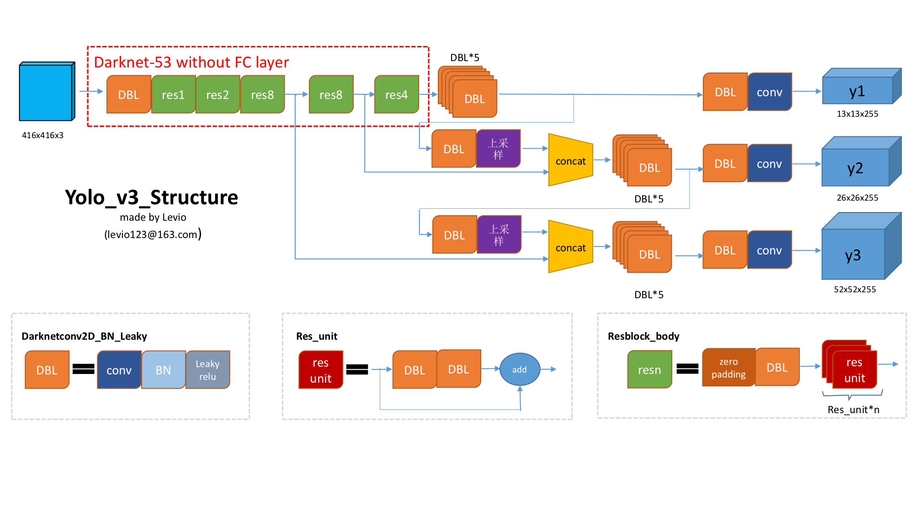

# darkent 源代码解析
参考代码路径：<https://github.com/xiaxinkai/darknet>  
说明：
- <https://github.com/xiaxinkai/darknet>是在<https://github.com/pjreddie/darknet>的基础上增加了1个demo内容所需的配置文件和图片。
- demo内容是：通过网络搜集NBA球员库里(KuLi)和杜兰特(DuLanTe)的图片进行训练，然后再用训练完成的weights参数来测试其他的图片。
- demo的详细内容请参考：<https://zhuanlan.zhihu.com/p/45852709>  
- demo的执行方法请参考：<https://github.com/xiaxinkai/darknet>
- 结合这个demo来说明darknet的原因是：这个demo只有40张标注好的图片训练样本，样本数量比较小，便于我们理解整个darknet训练和测试的原理。

## 全局观概述
- <https://github.com/pjreddie/darknet>中C语言实现的代码只是1个深度学习框架。
- YOLOv3算法是darknet通过读取配置文件cfg/yolov3.cfg来实现的。
- cfg/yolov3.cfg主要定义了YOLOv3的卷积神经网络的网络结构。
- darknet通过读取不同的配置文件，除了实现YOLOv3算法，还可以实现其他的算法，例如rnn(循环神经网络)，Tiny YOLOv3等。
- 如果想要使用自己的算法，创建自己的cfg文件，并在cfg文件内定义自己的网络结构即可。

## 以下将结合YOLOv3算法的实现来讲解darknet代码。
主要分为训练和测试两部分来讲解。

### [机能] 1. 训练
#### 命令行示例：  
`./darknet detector train cfg/KD.data cfg/yolov3-KD.cfg_train darknet53.conv.74`

#### 训练主要流程：
- examples/darknet.c line:400 入口函数  
`int main(int argc, char **argv)`  

- examples/darknet.c line:431 进入物体检测函数  
`run_detector(argc, argv);`

- examples/detector.c line:431 进入训练函数  
`else if(0==strcmp(argv[2], "train")) train_detector(datacfg, cfg, weights, gpus, ngpus, clear);`

- examples/detector.c line:26 读取cfg文件，创建神经网络  
`nets[i] = load_network(cfgfile, weightfile, clear);`

- examples/detector.c line:62 读取训练图像，开始训练  
`while(get_current_batch(net) < net->max_batches){`

- examples/detector.c line:123 计算损失  
`loss = train_network(net, train);`

- examples/detector.c line:136 每100个batch将当前权重备份到文件  
`save_weights(net, buff);`

- examples/detector.c line:144 从100到900，每100个batch将当前权重备份到文件，然后到10000的整数次batch备份一次  
`save_weights(net, buff);`

- examples/detector.c line:153 最后退出的时将当前权重保存到文件  
`save_weights(net, buff);`

#### 小结：
深度学习训练的一般流程就是：
- 提取特征数据，YOLOv3神经网络的前一小部分是通过darknet53来提取特征数据。
- 定义损失函数来计算损失
- 通过梯度下降等方法优化

可以照着以上思路去对代码进一步细化深入阅读理解。

### [机能] 2. 测试
#### 命令行示例：  
`./darknet detector test cfg/KD.data cfg/yolov3-KD.cfg_test backup/yolov3-KD_900.weights data/KD/val_images/41.jpg -thresh 0.5`

#### 测试主要流程：
- examples/darknet.c line:400 入口函数  
`int main(int argc, char **argv)`  

- examples/darknet.c line:431 进入物体检测函数  
`run_detector(argc, argv);`

- examples/detector.c line:836 进入测试函数  
`if(0==strcmp(argv[2], "test")) test_detector(datacfg, cfg, weights, filename, thresh, hier_thresh, outfile, fullscreen);`

- examples/detector.c line:26 读取cfg文件和权重文件，创建神经网络  
`network *net = load_network(cfgfile, weightfile, 0);`

- examples/detector.c line:597 将图片输入神经网络计算计算检测结果  
`network_predict(net, X);`

- examples/detector.c line:604 将网络的输出结果中的物体框绘制到图片中
`draw_detections(im, dets, nboxes, thresh, names, alphabet, l.classes);`

- examples/detector.c line:610 保存检测结果  
`save_image(im, "predictions");`

#### 小结：
深度学习测试的一般流程就是：
- 将测试样本数据输入到带有训练好的参数的神经网络，将结果按照要求输出或者保存。

### YOLOv3网络结构图：

